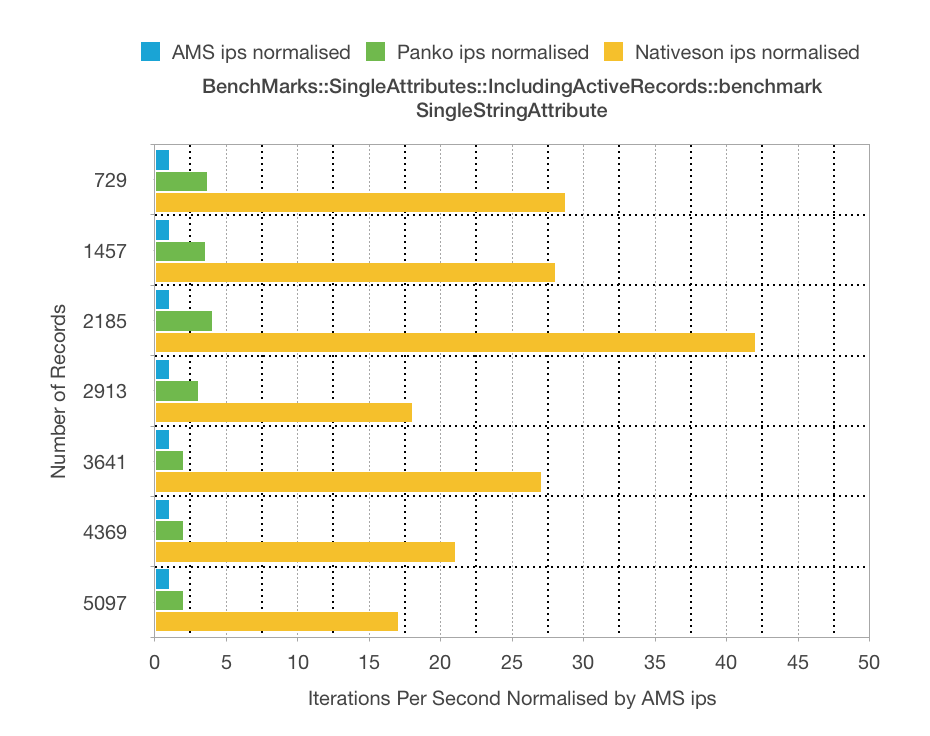

`BenchMarks::SingleAttributes::IncludingActiveRecords::benchmark` compares Nativeson performance to that of ActiveModel::Serializer (AMS) and Panko for database tables that have only a single column of a single datatype, for several datatypes.

Although extremely unrealistic, we expect that these cases will allow AMS and Panko to show their best possible performance, because they have the least possible number of ActiveRecord attribute values to instantiate. Results in the graphs below are normalized to AMS's performance and show that Nativeson performs between 12x and ~50x as fast as AMS and Panko performs between 1x and 6x as fast as AMS.

[Raw results Mac Numbers spreadsheet](BenchMarks--SingleAttributes--IncludingActiveRecords/BenchMarks--SingleAttributes--IncludingActiveRecords.numbers)

<table>
  <thead>
    <tr>
      <th>Model</th>
      <th>Comments</th>
      <th>Results</th>
    </tr>
  </thead>
  <tbody>
    <tr>
      <td>SingleDateTimeAttribute</td>
      <td></td>
      <td></td>
    </tr>
    <tr>
      <td>SingleFloatAttribute</td>
      <td></td>
      <td></td>
    </tr>
    <tr>
      <td>SingleIntegerAttribute</td>
      <td></td>
      <td></td>
    </tr>
    <tr>
      <td>SingleStringAttribute</td>
      <td></td>
      <td></td>
    </tr>    
  </tbody>
</table>

<table>
  <thead>
    <tr>
      <th>Model</th>
      <th>Comments</th>
      <th>Results</th>
    </tr>
  </thead>
  <tbody>
    <tr>
      <td>SingleDateTimeAttribute</td>
      <td></td>
      <td></td>
    </tr>
    <tr>
      <td>SingleFloatAttribute</td>
      <td></td>
      <td></td>
    </tr>
    <tr>
      <td>SingleIntegerAttribute</td>
      <td></td>
      <td></td>
    </tr>
    <tr>
      <td>SingleStringAttribute</td>
      <td></td>
      <td></td>
    </tr>    
  </tbody>
</table>
