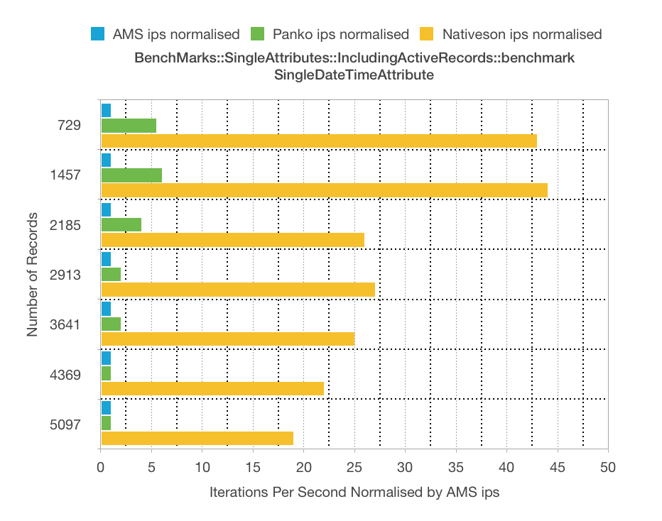
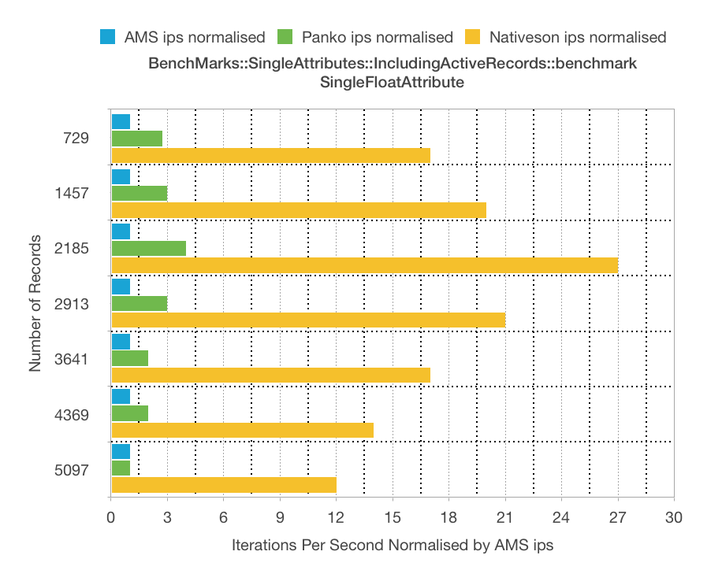
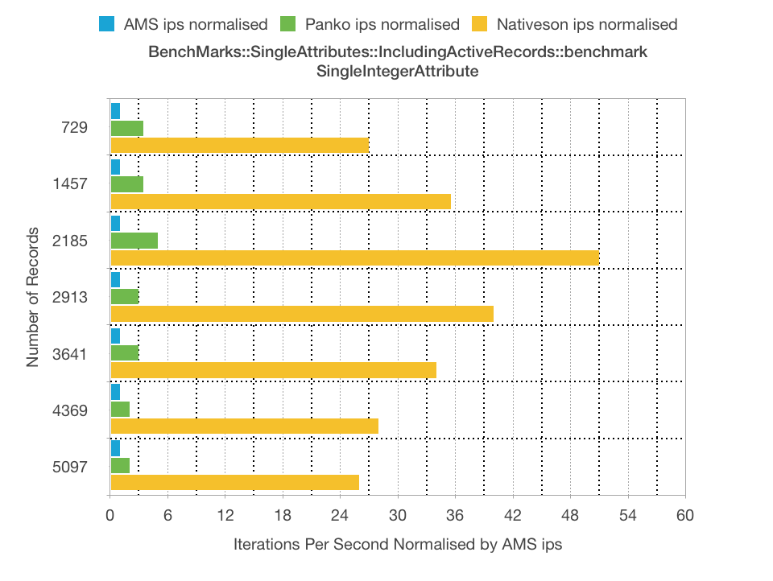
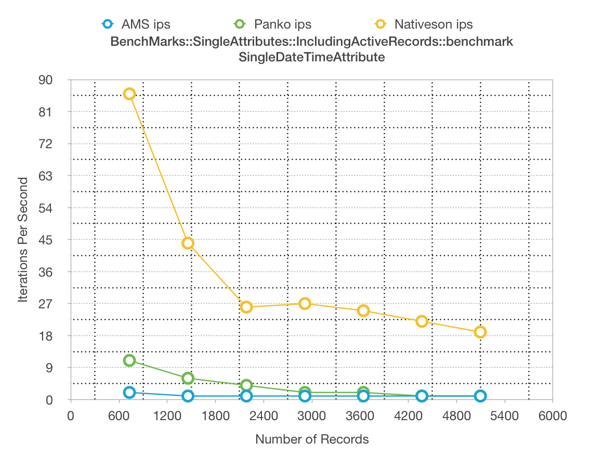
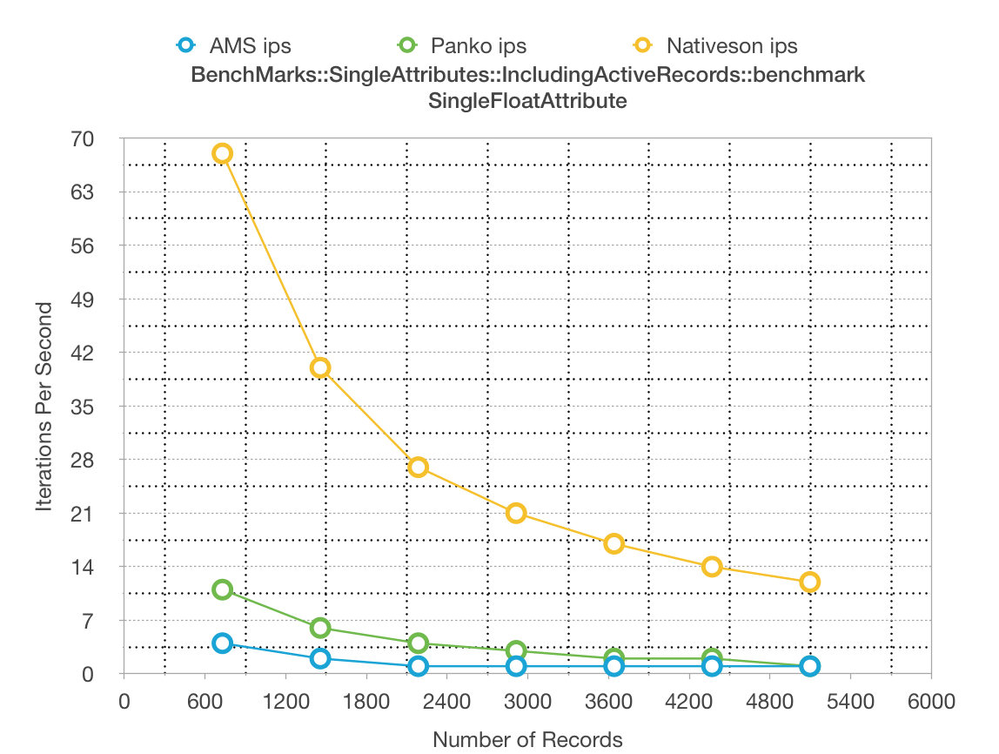
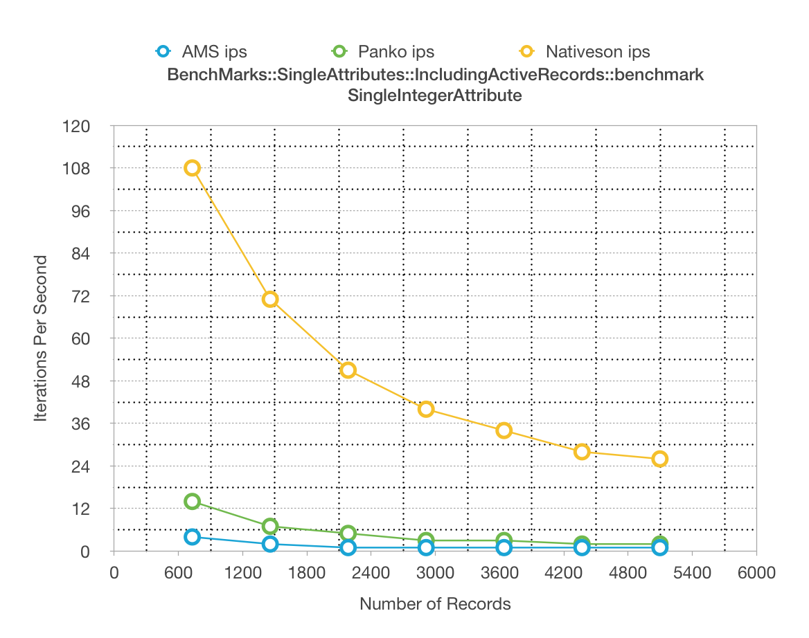

`BenchMarks::SingleAttributes::IncludingActiveRecords::benchmark`

[Raw results Mac Numbers spreadsheet](BenchMarks--SingleAttributes--IncludingActiveRecords/BenchMarks--SingleAttributes--IncludingActiveRecords.numbers)

<table>
  <thead>
    <tr>
      <th>Model</th>
      <th>Comments</th>
      <th>Results</th>
    </tr>
  </thead>
  <tbody>
    <tr>
      <td>SingleDateTimeAttribute</td>
      <td></td>
      <td></td>
    </tr>
    <tr>
      <td>SingleFloatAttribute</td>
      <td></td>
      <td></td>
    </tr>
    <tr>
      <td>SingleIntegerAttribute</td>
      <td></td>
      <td></td>
    </tr>
    <tr>
      <td>SingleStringAttribute</td>
      <td></td>
      <td></td>
    </tr>    
  </tbody>
</table>

<table>
  <thead>
    <tr>
      <th>Model</th>
      <th>Comments</th>
      <th>Results</th>
    </tr>
  </thead>
  <tbody>
    <tr>
      <td>SingleDateTimeAttribute</td>
      <td></td>
      <td></td>
    </tr>
    <tr>
      <td>SingleFloatAttribute</td>
      <td></td>
      <td></td>
    </tr>
    <tr>
      <td>SingleIntegerAttribute</td>
      <td></td>
      <td></td>
    </tr>
    <tr>
      <td>SingleStringAttribute</td>
      <td></td>
      <td></td>
    </tr>    
  </tbody>
</table>
